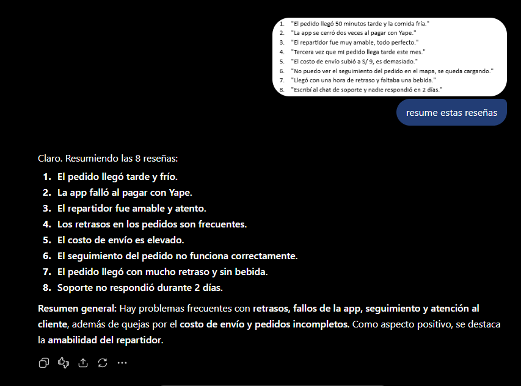
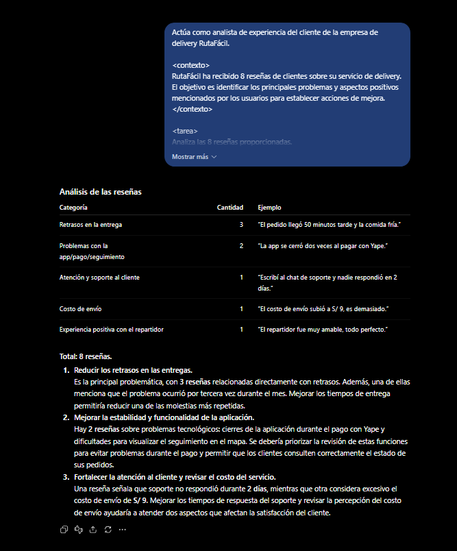
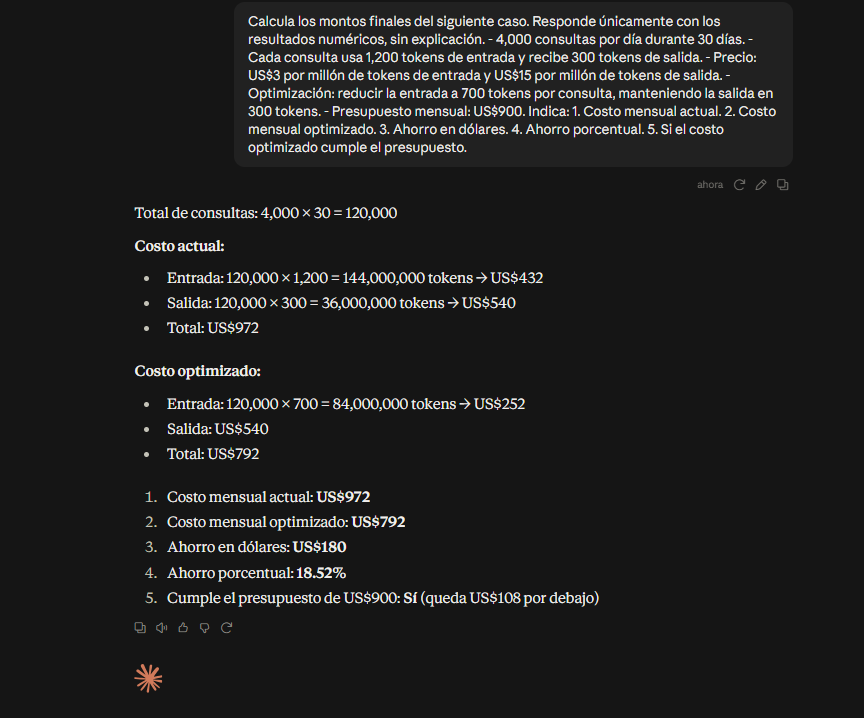
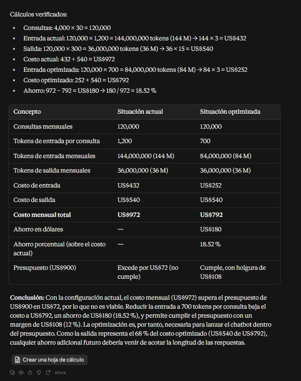
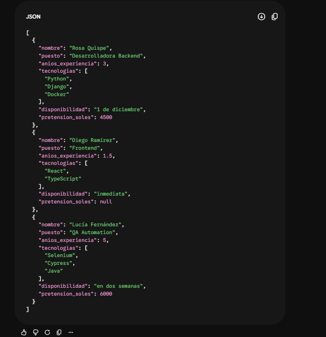
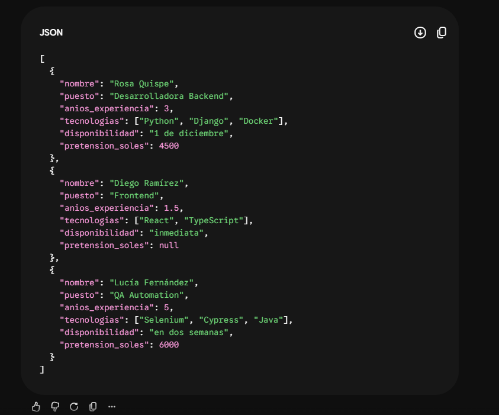

## Pregunta 1: Anatomía de un prompt efectivo

### 1.1 Análisis del prompt inicial

| Componente | Análisis |
|---|---|
| Rol | No está definido |
| Contexto | Insuficiente |
| Tarea | Solo indica que se debe resumir |
| Formato de salida | No está definido |
| Restricciones | No existen |

### 1.2 Ejecución del prompt inicial

**Prompt utilizado:**

> Resume estas reseñas.


### 1.3 Ejecución del prompt estructurado

Prompt utilizado:

```text
Actúa como analista de experiencia del cliente de la empresa de delivery RutaFácil.

<contexto>
RutaFácil ha recibido 8 reseñas de clientes sobre su servicio de delivery.
El objetivo es identificar los principales problemas y aspectos positivos
mencionados por los usuarios para establecer acciones de mejora.
</contexto>

<tarea>
Analiza las 8 reseñas proporcionadas.
Clasifica cada reseña según su problema o aspecto principal.
Cuenta cuántas reseñas pertenecen a cada categoría.
Identifica un ejemplo representativo de cada categoría.
Finalmente, propone 3 acciones prioritarias de mejora y justifica cada una
utilizando la información de las reseñas.
</tarea>

<formato>
Primero presenta una tabla Markdown con las columnas:
Categoría | Cantidad | Ejemplo

Después presenta una lista numerada con exactamente 3 acciones prioritarias
y la justificación de cada una.
</formato>

<restricciones>
- Utiliza únicamente la información proporcionada.
- No inventes datos.
- Cada reseña debe pertenecer a una sola categoría principal.
- La suma de las cantidades debe ser igual a 8.
- Mantén las categorías claras y evita crear categorías innecesarias.
</restricciones>

Estas son las reseñas:

1. "El pedido llegó 50 minutos tarde y la comida fría."
2. "La app se cerró dos veces al pagar con Yape."
3. "El repartidor fue muy amable, todo perfecto."
4. "Tercera vez que mi pedido llega tarde este mes."
5. "El costo de envío subió a S/ 9, es demasiado."
6. "No puedo ver el seguimiento del pedido en el mapa, se queda cargando."
7. "Llegó con una hora de retraso y faltaba una bebida."
8. "Escribí al chat de soporte y nadie respondió en 2 días."
```


### 1.4 Verificación del conteo

El conteo realizado manualmente fue comparado con el resultado generado por
ChatGPT.

| Categoría | Conteo manual | Conteo IA |
|---|---:|---:|
| Retrasos en la entrega | 3 | 3 |
| Problemas con la app/pago/seguimiento | 2 | 2 |
| Atención y soporte al cliente | 1 | 1 |
| Costo de envío | 1 | 1 |
| Experiencia positiva con el repartidor | 1 | 1 |
| **Total** | **8** | **8** |

El resultado de la IA coincide con el conteo manual. No se encontraron errores
en las cantidades obtenidas.

La reseña 7 ("Llegó con una hora de retraso y faltaba una bebida.") presenta
dos problemas. Sin embargo, fue clasificada como "Retrasos en la entrega"
porque el prompt estableció que cada reseña debía pertenecer a una sola
categoría principal.

### 1.5 Iteración del prompt

El resultado obtenido fue correcto desde la primera ejecución, por lo que no
fue necesario realizar una segunda iteración.

**Número de iteraciones: 1.**

## Pregunta 2: Optimización de costos de una API

## 2.1 Cálculo del costo actual

**Consultas mensuales:**

> 4,000 × 30 = 120,000 consultas

**Tokens de entrada actuales:**

> 120,000 × 1,200 = 144,000,000 tokens

**Tokens de salida:**

> 120,000 × 300 = 36,000,000 tokens

**Costo actual:**

> Entrada:  
> 144,000,000 / 1,000,000 × US$3 = US$432
>
> Salida:  
> 36,000,000 / 1,000,000 × US$15 = US$540
>
> Costo total:  
> US$432 + US$540 = **US$972**

## 2.2 Cálculo del costo optimizado

**Tokens de entrada optimizados:**

> 120,000 × 700 = 84,000,000 tokens

**Costo de entrada optimizado:**

> 84,000,000 / 1,000,000 × US$3 = **US$252**

**Costo de salida:**

> 36,000,000 / 1,000,000 × US$15 = **US$540**

**Costo total optimizado:**

> US$252 + US$540 = **US$792**

## 2.3 Ahorro obtenido

**Ahorro en dólares:**

> US$972 - US$792 = **US$180**

**Ahorro porcentual:**

> (US$180 / US$972) × 100 = **18.52%**

## 2.4 Comparación con el presupuesto

> Presupuesto mensual: **US$900**
>
> Costo actual: **US$972**
>
> Exceso sobre el presupuesto: **US$72**
>
> Costo optimizado: **US$792**
>
> Margen disponible: **US$108**

Por lo tanto, el costo actual **no cumple** con el presupuesto, mientras que el costo optimizado **sí cumple** con el presupuesto.

## 2.5 Ejecución del prompt directo

**Prompt utilizado:**

```text
Calcula los montos finales del siguiente caso. Responde únicamente con los resultados numéricos, sin explicación.

- 4,000 consultas por día durante 30 días.
- Cada consulta usa 1,200 tokens de entrada y recibe 300 tokens de salida.
- Precio: US$3 por millón de tokens de entrada y US$15 por millón de tokens de salida.
- Optimización: reducir la entrada a 700 tokens por consulta, manteniendo la salida en 300 tokens.
- Presupuesto mensual: US$900.

Indica:
1. Costo mensual actual.
2. Costo mensual optimizado.
3. Ahorro en dólares.
4. Ahorro porcentual.
5. Si el costo optimizado cumple el presupuesto.
```


## 2.6 Ejecución del prompt estructurado

**Prompt utilizado:**

```text
Actúa como analista financiero de TI de EduTech.

<contexto>
EduTech lanzará un chatbot de atención a estudiantes que utiliza una API
de modelo de lenguaje. El presupuesto mensual disponible es de US$900.
</contexto>

<datos>
- 4,000 consultas por día durante 30 días.
- Cada consulta utiliza 1,200 tokens de entrada.
- Cada consulta recibe 300 tokens de salida.
- Precio de entrada: US$3 por millón de tokens.
- Precio de salida: US$15 por millón de tokens.
- Optimización propuesta: reducir la entrada de 1,200 a 700 tokens por
  consulta, sin cambiar la salida.
</datos>

<tarea>
Calcula:
1. El número total de consultas mensuales.
2. Los tokens mensuales de entrada y salida actuales.
3. El costo mensual actual.
4. Los tokens mensuales de entrada optimizados.
5. El costo mensual optimizado.
6. El ahorro en dólares.
7. El ahorro porcentual.
8. Si el costo actual y el optimizado cumplen el presupuesto de US$900.
</tarea>

<formato>
Presenta los resultados en una tabla con las columnas:
Concepto | Situación actual | Situación optimizada

Después proporciona una conclusión breve indicando si la optimización
permite cumplir el presupuesto.
</formato>

<razonamiento>
Realiza los cálculos necesarios paso a paso y verifica las operaciones
antes de presentar la respuesta final.
</razonamiento>

Antes de responder, revisa que:
- Los costos de entrada y salida estén calculados por separado.
- Los tokens estén expresados correctamente en millones.
- El ahorro sea la diferencia entre ambos costos.
- El porcentaje de ahorro se calcule respecto al costo actual.
- La comparación con el presupuesto sea correcta.
```
**Resultado**



## 2.7 Comparación de resultados

| Concepto | Cálculo manual | Resultado de IA |
|---|---:|---:|
| Consultas mensuales | 120,000 | 120,000 |
| Tokens de entrada actuales | 144,000,000 | 144,000,000 |
| Tokens de salida | 36,000,000 | 36,000,000 |
| Costo actual | US$972 | US$972 |
| Tokens de entrada optimizados | 84,000,000 | 84,000,000 |
| Costo optimizado | US$792 | US$792 |
| Ahorro | US$180 | US$180 |
| Ahorro porcentual | 18.52% | 18.52% |
| Cumple presupuesto | Sí, con optimización | Sí, con optimización |

## 2.8 Conclusión

La respuesta de la IA coincide con los cálculos realizados manualmente.

La optimización reduce el costo mensual de **US$972 a US$792**, generando un ahorro de **US$180**, equivalente al **18.52%**.

El costo actual supera el presupuesto de US$900, mientras que el costo optimizado se encuentra **US$108 por debajo del presupuesto**.

Por lo tanto, la optimización permite cumplir con el presupuesto establecido.

# Pregunta 3: Extracción estructurada con few-shot

**IA utilizada:** Gemini

## 3.1 Esquema JSON

El esquema definido para la extracción de información es:

```json
{
  "nombre": "string",
  "puesto": "string",
  "anios_experiencia": "number",
  "tecnologias": ["string"],
  "disponibilidad": "string",
  "pretension_soles": "number"
}
```
## 3.2 Ejecución Zero-Shot

**Prompt utilizado:**

```text
Actúa como un sistema de extracción de información para la consultora TalentoTech.

Convierte cada uno de los siguientes correos en un objeto JSON.

Utiliza exactamente estos campos:

{
  "nombre": "string",
  "puesto": "string",
  "anios_experiencia": "number",
  "tecnologias": ["string"],
  "disponibilidad": "string",
  "pretension_soles": "number"
}

Reglas:
- No agregues campos adicionales.
- Extrae únicamente información presente en los correos.
- Convierte expresiones como "año y medio" a 1.5.
- Convierte expresiones como "6 meses" a 0.5.
- Si un dato no está presente, utiliza null.
- Mantén las tecnologías como una lista.
- La pretensión salarial debe ser un número en soles.
- Devuelve únicamente un arreglo JSON válido.

Correos:

1. "Buenas tardes, me llamo Rosa Quispe y postulo al puesto de Desarrolladora Backend. Tengo 3 años trabajando con Python y Django, y algo de Docker. Puedo empezar el 1 de diciembre. Mi expectativa es S/ 4,500."

2. "Hola, soy Diego Ramírez. Me interesa la vacante de Frontend. Llevo año y medio con React y TypeScript. Disponibilidad inmediata."

3. "Estimados, adjunto mi CV para QA Automation. Mi nombre es Lucía Fernández; 5 años de experiencia con Selenium, Cypress y Java. Pretensión: 6000 soles. Podría incorporarme en dos semanas."
```

**Resultado**



## 3.3 Diseño de ejemplos Few-Shot

Para mejorar la extracción se diseñaron tres ejemplos que enseñan a Gemini cómo convertir expresiones de texto libre al formato JSON solicitado.

### Ejemplo 1

**Correo:**

> Hola, soy Carlos Mendoza. Postulo a Backend Developer.
> Tengo 2 años de experiencia usando Python y Flask.
> Puedo comenzar el 15 de enero y espero ganar S/ 4,000.

**JSON esperado:**

```json
{
  "nombre": "Carlos Mendoza",
  "puesto": "Backend Developer",
  "anios_experiencia": 2,
  "tecnologias": [
    "Python",
    "Flask"
  ],
  "disponibilidad": "15 de enero",
  "pretension_soles": 4000
}
```

### Ejemplo 2

**Correo:**

> Buenas, mi nombre es Ana Torres. Estoy interesada en el puesto de Frontend.
> Llevo año y medio trabajando con React y TypeScript.
> Tengo disponibilidad inmediata.

**JSON esperado:**

```json
{
  "nombre": "Ana Torres",
  "puesto": "Frontend",
  "anios_experiencia": 1.5,
  "tecnologias": [
    "React",
    "TypeScript"
  ],
  "disponibilidad": "inmediata",
  "pretension_soles": null
}tension_soles": 4000
}
```
### Ejemplo 3

**Correo:**

> Estimados, soy Luis Pérez y postulo para QA Tester.
> Tengo 6 meses de experiencia con Selenium.
> Mi pretensión es de S/ 2,500 y puedo incorporarme en dos semanas.

**JSON esperado:**

```json
{
  "nombre": "Luis Pérez",
  "puesto": "QA Tester",
  "anios_experiencia": 0.5,
  "tecnologias": [
    "Selenium"
  ],
  "disponibilidad": "en dos semanas",
  "pretension_soles": 2500
}
}
```
Estos ejemplos permiten enseñar a Gemini cómo realizar la conversión de texto libre a JSON, especialmente en casos como:

* "año y medio" → 1.5
* "6 meses" → 0.5
* Dato no disponible → null
* Varias tecnologías → lista

## 3.4 Ejecución Zero-Shot

**Prompt utilizado:**

```text
Actúa como un sistema de extracción de información para la consultora TalentoTech.

Convierte cada correo en un objeto JSON utilizando exactamente este esquema:

{
  "nombre": "string",
  "puesto": "string",
  "anios_experiencia": "number",
  "tecnologias": ["string"],
  "disponibilidad": "string",
  "pretension_soles": "number"
}

Reglas:
- No agregues campos adicionales.
- Extrae únicamente información presente en los correos.
- Convierte "año y medio" a 1.5.
- Convierte "6 meses" a 0.5.
- Si un dato no está presente, utiliza null.
- Mantén las tecnologías como una lista.
- La pretensión salarial debe ser un número.
- Devuelve únicamente un arreglo JSON válido.

EJEMPLO 1

Correo:
"Hola, soy Carlos Mendoza. Postulo a Backend Developer.
Tengo 2 años de experiencia usando Python y Flask.
Puedo comenzar el 15 de enero y espero ganar S/ 4,000."

JSON:
{
  "nombre": "Carlos Mendoza",
  "puesto": "Backend Developer",
  "anios_experiencia": 2,
  "tecnologias": ["Python", "Flask"],
  "disponibilidad": "15 de enero",
  "pretension_soles": 4000
}

EJEMPLO 2

Correo:
"Buenas, mi nombre es Ana Torres. Estoy interesada en el puesto de Frontend.
Llevo año y medio trabajando con React y TypeScript.
Tengo disponibilidad inmediata."

JSON:
{
  "nombre": "Ana Torres",
  "puesto": "Frontend",
  "anios_experiencia": 1.5,
  "tecnologias": ["React", "TypeScript"],
  "disponibilidad": "inmediata",
  "pretension_soles": null
}

EJEMPLO 3

Correo:
"Estimados, soy Luis Pérez y postulo para QA Tester.
Tengo 6 meses de experiencia con Selenium.
Mi pretensión es de S/ 2,500 y puedo incorporarme en dos semanas."

JSON:
{
  "nombre": "Luis Pérez",
  "puesto": "QA Tester",
  "anios_experiencia": 0.5,
  "tecnologias": ["Selenium"],
  "disponibilidad": "en dos semanas",
  "pretension_soles": 2500
}

AHORA PROCESA ESTOS CORREOS:

1. "Buenas tardes, me llamo Rosa Quispe y postulo al puesto de Desarrolladora Backend. Tengo 3 años trabajando con Python y Django, y algo de Docker. Puedo empezar el 1 de diciembre. Mi expectativa es S/ 4,500."

2. "Hola, soy Diego Ramírez. Me interesa la vacante de Frontend. Llevo año y medio con React y TypeScript. Disponibilidad inmediata."

3. "Estimados, adjunto mi CV para QA Automation. Mi nombre es Lucía Fernández; 5 años de experiencia con Selenium, Cypress y Java. Pretensión: 6000 soles. Podría incorporarme en dos semanas."
```

**Resultado**



## 3.5 Validación de las salidas JSON

### Validación Zero-Shot

- JSON válido: **Sí**
- Respeta los nombres de los campos: **Sí**
- `anios_experiencia` como número: **Sí**
- `tecnologias` como lista: **Sí**
- `pretension_soles` como número o `null`: **Sí**
- Conversión de "año y medio": **Correcta**
- Campos faltantes convertidos a `null`: **Correcto**

### Validación Few-Shot

- JSON válido: **Sí**
- Respeta los nombres de los campos: **Sí**
- `anios_experiencia` como número: **Sí**
- `tecnologias` como lista: **Sí**
- `pretension_soles` como número o `null`: **Sí**
- Conversión de "año y medio": **Correcta**
- Campos faltantes convertidos a `null`: **Correcto**

## 3.6 Comparación de resultados

| Criterio | Zero-Shot | Few-Shot |
|---|---|---|
| JSON válido | Sí | Sí |
| Campos correctos | Sí | Sí |
| Tipos de datos correctos | Sí | Sí |
| Tecnologías como lista | Sí | Sí |
| Conversión "año y medio" → 1.5 | Sí | Sí |
| Uso de `null` | Sí | Sí |
| Información extra inventada | No | No |
| Resultado estructurado | Correcto | Correcto |

### Métricas

| Métrica | Zero-Shot | Few-Shot |
|---|---:|---:|
| Correos procesados | 3 | 3 |
| JSON válidos | 3/3 | 3/3 |
| Campos correctos | 18/18 | 18/18 |
| Campos faltantes correctamente identificados | 1/1 | 1/1 |
| Errores detectados | 0 | 0 |

## 3.7 Conclusión

Ambas versiones lograron convertir correctamente los tres correos al esquema JSON solicitado.

El prompt Zero-Shot fue suficiente para obtener una salida válida y estructurada. Sin embargo, el enfoque Few-Shot proporciona ejemplos concretos sobre cómo convertir expresiones como "año y medio" y "6 meses", además de mostrar cómo utilizar null cuando un dato no está presente.

En este caso, ambas técnicas obtuvieron resultados correctos, por lo que no se encontraron diferencias significativas en la salida final.